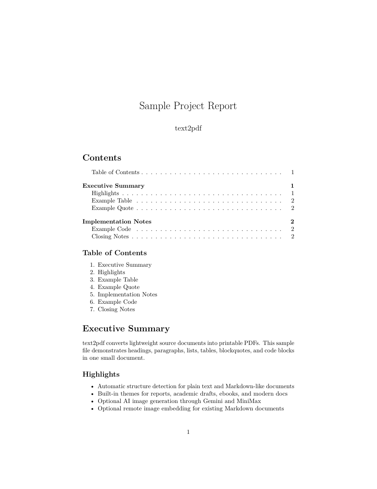
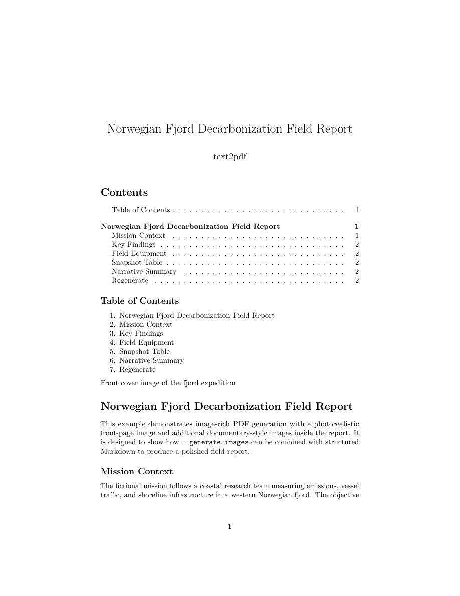
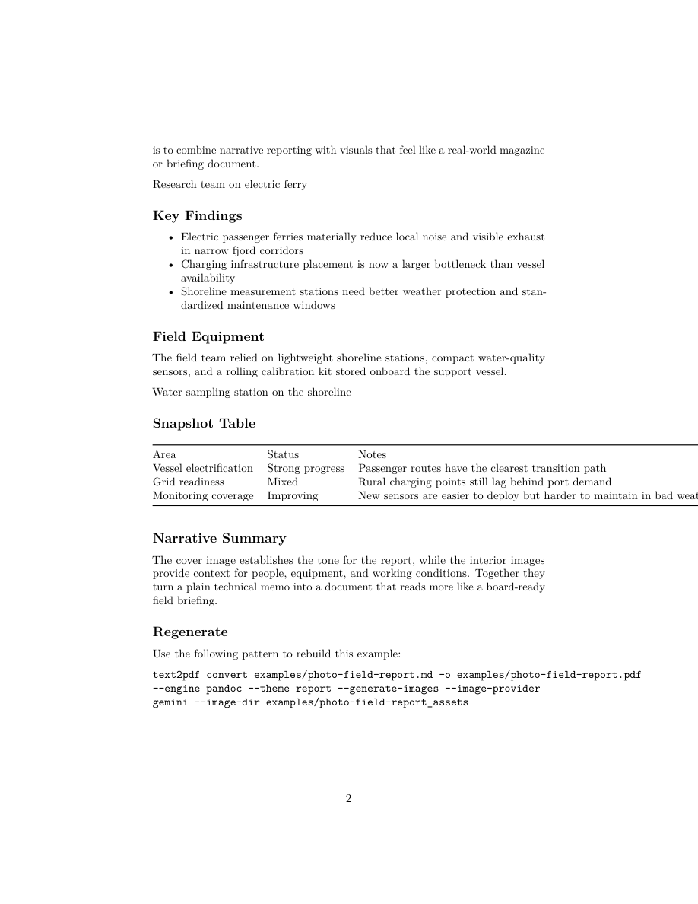

# Examples

This directory contains two end-to-end samples for `text2pdf`.

## Included Examples

### `sample-report`

Basic non-AI sample:

- `sample-report.md`: source document
- `sample-report.pdf`: generated PDF output
- `assets/sample-report-page1.png`: preview image of page 1

Regenerate:

```powershell
text2pdf convert examples\sample-report.md -o examples\sample-report.pdf --engine pandoc --theme report --header "text2pdf sample" --footer "Page {page} of {pages}"
```

Preview:



### `photo-field-report`

Image-rich example with a photorealistic cover image plus additional inline content images generated through the `[[image: ...]]` directive flow:

- `photo-field-report.md`: source document with inline AI image directives
- `photo-field-report.pdf`: generated PDF output
- `photo-field-report_assets/image_001.png`: generated front-page image
- `photo-field-report_assets/image_002.png`: generated content image
- `photo-field-report_assets/image_003.png`: generated content image
- `assets/photo-field-report-page1.png`: preview of page 1
- `assets/photo-field-report-page2.png`: preview of page 2

Regenerate:

```powershell
text2pdf convert examples\photo-field-report.md `
  -o examples\photo-field-report.pdf `
  --engine pandoc `
  --theme report `
  --generate-images `
  --image-provider gemini `
  --image-dir examples\photo-field-report_assets `
  --header "text2pdf photo example" `
  --footer "Page {page} of {pages}"
```

Previews:




